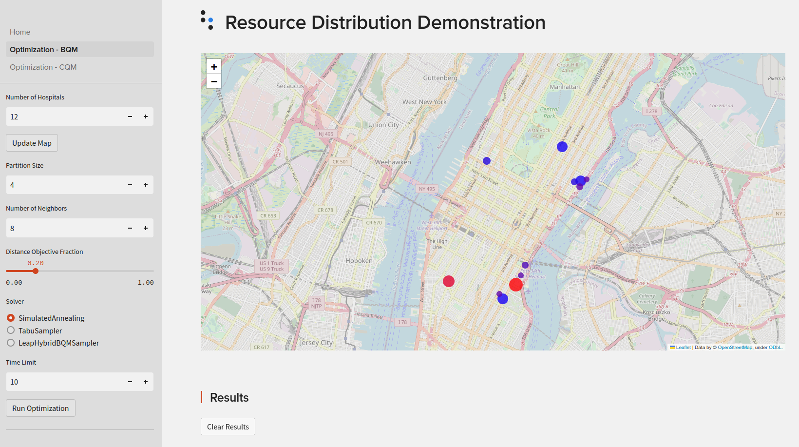

[](
  https://codespaces.new/dwave-examples/resource-distribution?quickstart=1)

# Resource Distribution

The ongoing Covid-19 pandemic has resulted in millions of people being infected and 
has overwhelmed health systems. Many hospitals are facing a critical shortage of 
essential resources such as invasive ventilators, ICU beds, and personal protective gear. 
It is imperative to optimize the allocation of resources. The goal is to group hospitals 
in such a way that shared resources are maximized within each group while ensuring fair 
distribution across different groups.

This demo presents two ways of formulating the problem: as a binary quadratic model (BQM)
and as a constrained quadratic model (CQM). More details regarding formulation and 
implementation can be found on the Home page of the web app.

## Usage

To run the web app:

```bash
pip install -r requirements.txt
streamlit run Home.py
```

The web app should automatically open in your browser. Alternatively, copy and paste 
the provided link into your browser for access.

## Snapshot


