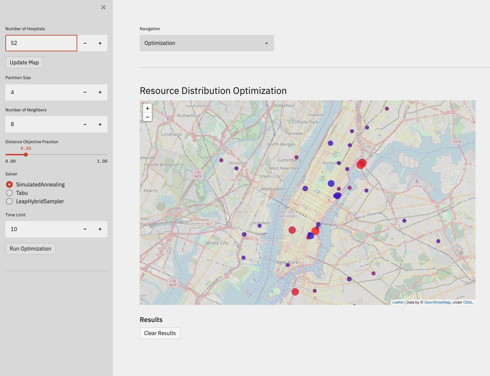

# Resource Distribution

The ongoing Covid-19 pandemic has caused millions of people being infected and
overwhelmed the health system. Many hospitals are facing a critical shortage for
essential resources such as invasive ventilators, ICU beds and personal
protective gears. It becomes imperative to optimize the allocation of resources.
The goal is to group hospitals in such a way that shared goods and services are
maximized within each of the groups while ensuring fair distribution across
different groups.

In resource distribution optimization, we would like to find
the optimal partitioning of a fixed amount of resources to users or processes
such that the total cost is minimized or utility is maximized. We are going to
consider two scenarios. In the first scenario, the objective is at most a
quadratic function of resources. For example, the utility function of medical
centres only depends on the location and other attributes of each medical centre
or each pair of medical centres. In the second scenario, the objective can be
more general, and it could depend on the collective property of a set of
variables.

## Usage

To run the web-app:

```bash
pip install -r requirements.txt
streamlit run app.py
```

You'll see that the app is now running on port 5000 of your local. Now, you can
copy and paste the provided link into your browser for access.

## Snapshot


