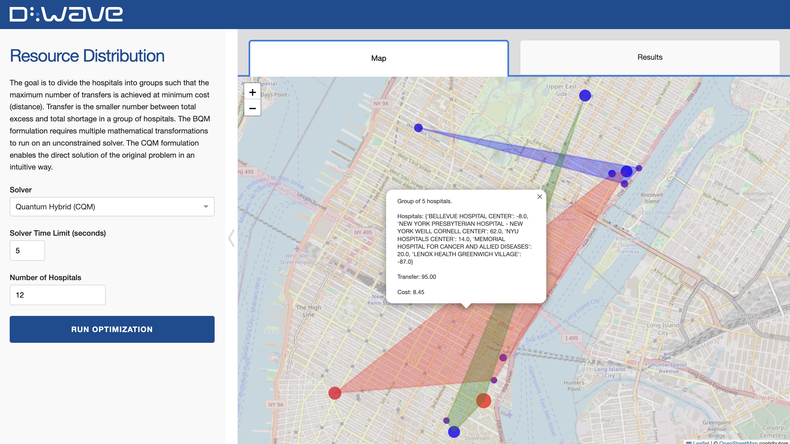
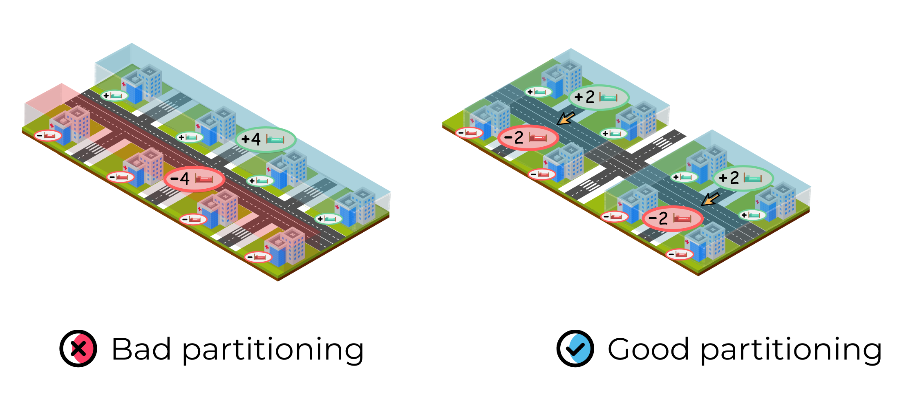
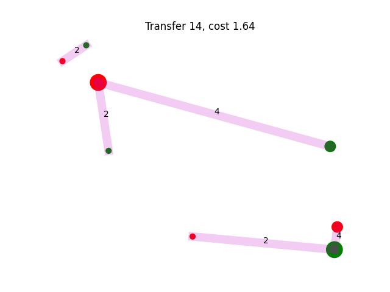

[](
  https://codespaces.new/dwave-examples/resource-distribution?quickstart=1)

# Resource Distribution

The Covid-19 pandemic has resulted in millions of people being infected and 
has overwhelmed health systems. Many hospitals are facing a critical shortage of 
essential resources such as invasive ventilators, ICU beds, and personal protective gear. 
It is imperative to optimize the allocation of resources. The goal is to group hospitals 
in such a way that shared resources are maximized within each group while ensuring fair 
distribution across different groups.

This demo presents two ways of formulating the problem: as a binary quadratic model (BQM)
and as a constrained quadratic model (CQM).



## Installation

You can run this example without installation in cloud-based IDEs that support the
[Development Containers specification](https://containers.dev/supporting) (aka "devcontainers")
such as GitHub Codespaces.

For development environments that do not support `devcontainers`, install requirements:

```bash
pip install -r requirements.txt
```

If you are cloning the repo to your local system, working in a
[virtual environment](https://docs.python.org/3/library/venv.html) is recommended.

## Usage
Your development environment should be configured to access the
[Leap&trade; Quantum Cloud Service](https://docs.ocean.dwavesys.com/en/stable/overview/sapi.html).
You can see information about supported IDEs and authorizing access to your Leap account
[here](https://docs.dwavesys.com/docs/latest/doc_leap_dev_env.html).

Run the following terminal command to start the Dash app:

```bash
python app.py
```

Access the user interface with your browser at http://127.0.0.1:8050/.

The demo program opens an interface where you can configure problems and submit these problems to
a solver.

Configuration options can be found in the [demo_configs.py](demo_configs.py) file.

> [!NOTE]\
> If you plan on editing any files while the app is running,
please run the app with the `--debug` command-line argument for live reloads and easier debugging:
`python app.py --debug`


## Problem Formulation



### BQM

In the BQM formulation, the goal is to divide the hospitals into groups such that the maximum
number of transfers is achieved at minimum cost. Transfer is quantified as the smaller
number between total excess and total shortage in a group of hospitals. Cost is the sum of all
costs associated with transferring resources from one hospital to another: In this demonstration,
only distance is considered as a cost.

#### Variables

- **Partition Size**: The size of the groups to divide the hospitals into. If there are 12 hospitals
and the partition size is 4, the hospitals will be divided into 3 groups of 4.
- **Number of Neighbors**: Finding all possible groups of size `partition_size` is very time
consuming, instead we will only consider the possible groups within the `num_neighbors` closest
neighbors. If `num_neighbors` is 8, the 9th farthest away hospital from hospital $x$ will not be
permitted in groups containing hospital $x$.
- **Distance Objective Fraction**: The balance between optimizing for maximum transfer or
minimum distance traveled cost. If the distance objective fraction is low the transfer is high.
If the DOF is high the transfer is low and the distance traveled/cost is low.



#### Utility Function

Before formulating the BQM, a utility function must be defined.

Let's say that there are eight hospitals with the various number of ICU beds $u = (a_1, ..., a_8)$.
The values $a_i$ can be positive (excess) or negative (shortage). Let’s assume that $u_p = (a_1, ..., a_4)$
are positive and $u_n = (a_5, ..., a_8)$ are negative.

The maximum transfer is equal to

$$t = \min\left(\sum_{i \in u_p} a_i, -\sum_{i \in u_n} a_i\right)$$


For example, if there are fewer hospitals with a positive $a_i$ (excess), maximum transfer is equal 
to the magnitude of $sum_{i \in u_p} a_i$.

The cost for each group $u$ is determined by summing up the distances of transfers between
hospitals. Transfers occur only between members of $u_p$ and $u_n$.

So the maximum cost is:

$$c = \sum_{i \in u_p, j \in u_n} d_{i,j} x_{i,j}$$

Finally, we can define utility as a balance between cost and transfer.

$$U[u] = (1 - \alpha) t - \alpha c$$

#### Formulation

Given the utility function above, or any utility function that can compute a value for a given
subset $u$, we can use the following $k$-clique problem to find the best division of medical
centers to $k$ groups [1].

First, we define the set of partitions of size $n/k$ as

$$\mathcal{V} = \left\lbrace u: \forall ~ u \subset S ~\land ~|u| = \frac{n}{k} \right\rbrace$$

We can define the set of edges as a pair of nodes that share elements (this is the complement
set of the original as defined in [1]).

$$\mathcal{E} = \left\lbrace (u, v): \forall ~ u,v \in \mathcal{V} ~\land ~~ u \cap v \neq \{\} \right\rbrace$$

Because the nodes in $\mathcal{E}$ are derived from partitions of size $n/k$, there can be
no clique larger than $k$. Therefore, all we need to do is to solve the weighted
maximum-independent-set problem with weights equal to the utility function and some regularization
factor. If the utility function is defined as $U: \mathcal{V} \rightarrow R$, we can write the
objective function as,

$$H = - \sum_u (U_u + R)~ x_u + \lambda \sum_{u, n \in \mathcal{E}} x_u x_u$$

where, $x_u$ is a binary variable that decides if the group $u$ is selected.

### CQM

The BQM formulation requires multiple mathematical transformations to run on an unconstrained
solver: the original problem is reformulated as a maximum-independent-set problem.

The CQM formulation enables the direct solution of the original problem in an intuitive way.

#### Formulation

We define a binary variable $x$ for each pair $(i, g)$, where $i$ is a hospital and $g$
is a hospital group. If the solution returns variable $(i, g) = 1$, then hospital $i$ is 
assigned to group $g$.

Let's start with our constraints.

**Constraint 1: Each hospital must be assigned to exactly one group**

$$\sum_{g} x_{i,g} = 1\text{, for each hospital }i$$

```
for i in hospitals:
    cqm.add_discrete([(i, g) for g in range(num_groups)])
```

**Constraint 2: Each group must have a net positive number of beds**

$$\sum_{i} a_{i} x_{i,g} >= 0,\\
\text{for each group }g\text{, }\text{where }a_{i} \text{ is the number of beds that hospital }i\text{ has.}$$

```
for g in range(num_groups):
    cqm.add_constraint(sum(variables[i, g] * a for i, a in hospitals.items()) >= 0)
```

#### Objective

Our last step is to **minimize the transfer cost** by adding an objective to the CQM. Cost is 
equivalent to the sum of the maximum transfer distance in each group.

Given that $u_p$ are hospitals with a positive number of beds (surplus), $u_n$ are hospitals
with a negative number of beds (shortage), and $d_{i,j}$ is the distance between hospital $i$
and hospital $j$, the cost can be defined as:

$$c = \sum_{i \in u_p, j \in u_n} d_{i,j} x_{i,g} x_{j,g}\text{, for each group }g$$

```
objective = 0
for i, beds0 in hospitals.items():
    for j, beds1 in hospitals.items():
        if beds0 > 0 and beds1 < 0:
            for g in range(num_groups):
                objective += distances[i, j]*variables[i, g]*variables[j, g]
cqm.set_objective(objective)
```

We now have a CQM that is ready to be sampled with the `LeapHybridCQMSampler`.

In the code above, note that:
- `cqm` is a `dimod.ConstrainedQuadraticModel`
- `hospitals` is a `dict` in which keys are hospital names and values
are the number of excess beds in each hospital
- `num_groups` is the number of groups to separate the hospitals into
- `variables` is a `dict` in which keys are `(i, g)` 
and values are the binary variables that determine whether hospital `i` should be 
in group `g`
- `distances` is a `dict` in which keys are pairs of hospitals and 
values are the distances between the two hospitals

## References

[1] Bass, Gideon, et al. "Heterogeneous quantum computing for satellite constellation optimization:
solving the weighted k-clique problem." Quantum Science and Technology 3.2 (2018): 024010.

## License

Released under the Apache License 2.0. See [LICENSE](LICENSE) file.
