[](
  https://codespaces.new/dwave-examples/resource-distribution?quickstart=1)

# Resource Distribution

The Covid-19 pandemic has resulted in millions of people being infected and 
has overwhelmed health systems. Many hospitals are facing a critical shortage of 
essential resources such as invasive ventilators, ICU beds, and personal protective gear. 
It is imperative to optimize the allocation of resources. The goal is to group hospitals 
in such a way that shared resources are maximized within each group while ensuring fair 
distribution across different groups.

This demo presents two ways of formulating the problem: as a binary quadratic model (BQM)
and as a constrained quadratic model (CQM).

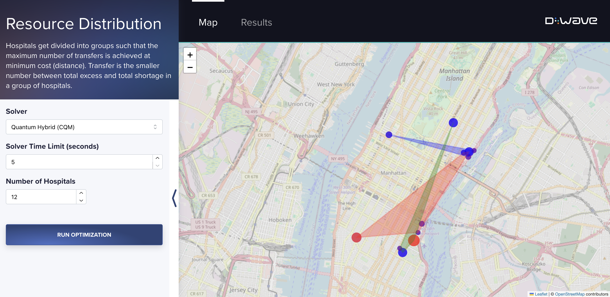

## Installation
You can run this example without installation in cloud-based IDEs that support the
[Development Containers Specification](https://containers.dev/supporting) (aka "devcontainers")
such as GitHub Codespaces.

For development environments that do not support `devcontainers`, install requirements:

```bash
pip install -r requirements.txt
```

If you are cloning the repo to your local system, working in a
[virtual environment](https://docs.python.org/3/library/venv.html) is recommended.

## Usage
Your development environment should be configured to access the
[Leap&trade; quantum cloud service](https://docs.dwavequantum.com/en/latest/ocean/sapi_access_basic.html).
You can see information about supported IDEs and authorizing access to your Leap account
[here](https://docs.dwavequantum.com/en/latest/ocean/leap_authorization.html).

Run the following terminal command to start the Dash application:

```bash
python app.py
```

Access the user interface with your browser at http://127.0.0.1:8050/.

The demo program opens an interface where you can configure problems and submit these problems to
a solver.

Configuration options can be found in the [demo_configs.py](demo_configs.py) file.

> [!NOTE]\
> If you plan on editing any files while the application is running, please run the application
with the `--debug` command-line argument for live reloads and easier debugging:
`python app.py --debug`


## Problem Description

This demo solves a hospital resource-sharing problem: given hospitals with either surplus or
shortage of resources, assign hospitals to groups and prioritize transfer opportunities so shortages
can be mitigated with minimal transfer cost.

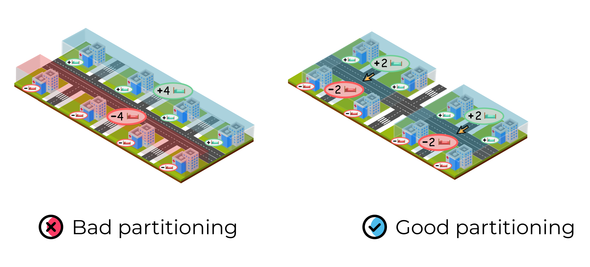

## Model Overview

The BQM formulation requires multiple mathematical transformations to run on an unconstrained
solver: the original problem is reformulated as a maximum-independent-set problem.

The CQM formulation enables the direct solution of the original problem in an intuitive way.

### BQM

In the BQM formulation, the goal is to divide the hospitals into groups such that the maximum
number of transfers is achieved at minimum cost. Transfer is quantified as the smaller
number between total excess and total shortage in a group of hospitals. Cost is the sum of all
costs associated with transferring resources from one hospital to another. In this demonstration,
only distance is considered as a cost.

#### Variables

- **Partition Size**: The size of the groups to divide the hospitals into. If there are 12 hospitals
and the partition size is 4, the hospitals will be divided into 3 groups of 4.
- **Number of Neighbors**: Finding all possible groups of size `partition_size` is very time
consuming, instead we will only consider the possible groups within the `num_neighbors` closest
neighbors. If `num_neighbors` is 8, the 9th farthest away hospital from hospital x will not be
permitted in groups containing hospital x.
- **Distance Objective Fraction**: The balance between optimizing for maximum transfer or
minimum distance traveled cost. If the distance objective fraction is low the transfer is high.
If the DOF is high the transfer is low and the distance traveled/cost is low.

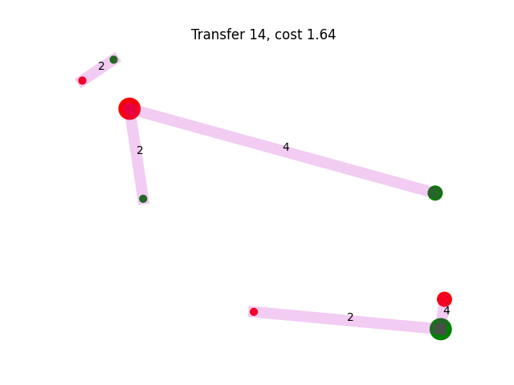

#### Utility Function

Before formulating the BQM, a utility function must be defined.

Let's say that there are eight hospitals with the various number of ICU beds _u = (a_1, ..., a_8)_.
The values _a_i_ can be positive (excess) or negative (shortage). Let’s assume that _u_p = (a_1, ..., a_4)_
are positive and _u_n = (a_5, ..., a_8)_ are negative.

The maximum transfer is equal to

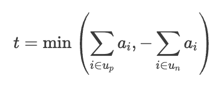


For example, if there are fewer hospitals with a positive _a_i_ (excess), maximum transfer is equal 
to the magnitude of _sum(a_i)_ for _i_ ∈ _u_p_.

The cost for each group _u_ is determined by summing up the distances of transfers between
hospitals. Transfers occur only between members of _u_p_ and _u_n_.

So the maximum cost is:

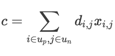

Finally, we can define utility as a balance between cost and transfer.

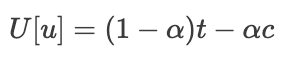

#### Formulation

Given the utility function above, or any utility function that can compute a value for a given
subset _u_, we can use the following _k_-clique problem to find the best division of medical
centers to _k_ groups [1].

First, we define the set of partitions of size _n/k_ as

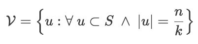

We can define the set of edges as a pair of nodes that share elements (this is the complement
set of the original as defined in [1]).

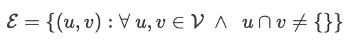

Because the nodes in _E_ are derived from partitions of size _n/k_, there can be
no clique larger than _k_. Therefore, all we need to do is to solve the weighted
maximum-independent-set problem with weights equal to the utility function and some regularization
factor. If the utility function is defined as _U_: _V_ -> _R_, we can write the
objective function as,

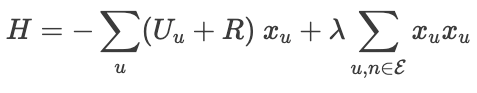

where, _x_u_ is a binary variable that decides if the group _u_ is selected.

### CQM

**Objective**

Minimize transfer cost, which is the sum of the maximum transfer distance in each group.

**Constraints**
- Each hospital must belong to exactly one group.
- Each group must have a net positive number of beds.

#### Formulation

We define a binary variable _x_ for each pair (_i_, _g_), where _i_ is a hospital and _g_
is a hospital group. If the solution returns variable (_i_, _g_) = 1, then hospital _i_ is 
assigned to group _g_.

Let's start with our constraints.

**Constraint 1: Each hospital must be assigned to exactly one group**

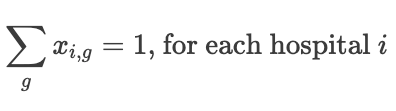

```
for i in hospitals:
    cqm.add_discrete([(i, g) for g in range(num_groups)])
```

**Constraint 2: Each group must have a net positive number of beds**

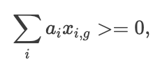

```
for g in range(num_groups):
    cqm.add_constraint(sum(variables[i, g] * a for i, a in hospitals.items()) >= 0)
```

#### Objective

Our last step is to **minimize the transfer cost** by adding an objective to the CQM. Cost is 
equivalent to the sum of the maximum transfer distance in each group.

Given that _u_p_ are hospitals with a positive number of beds (surplus), _u_n_ are hospitals
with a negative number of beds (shortage), and _d__{_i_,_j_} is the distance between hospital _i_
and hospital _j_, the cost can be defined as:

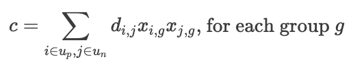

```
objective = 0
for i, beds0 in hospitals.items():
    for j, beds1 in hospitals.items():
        if beds0 > 0 and beds1 < 0:
            for g in range(num_groups):
                objective += distances[i, j]*variables[i, g]*variables[j, g]
cqm.set_objective(objective)
```

We now have a CQM that is ready to be sampled with the `LeapHybridCQMSampler`.

In the code above, note that:
- `cqm` is a `dimod.ConstrainedQuadraticModel`
- `hospitals` is a `dict` in which keys are hospital names and values
are the number of excess beds in each hospital
- `num_groups` is the number of groups to separate the hospitals into
- `variables` is a `dict` in which keys are `(i, g)` 
and values are the binary variables that determine whether hospital `i` should be 
in group `g`
- `distances` is a `dict` in which keys are pairs of hospitals and 
values are the distances between the two hospitals

## References

[1] Bass, Gideon, et al. "Heterogeneous quantum computing for satellite constellation optimization:
solving the weighted k-clique problem." Quantum Science and Technology 3.2 (2018): 024010.

## License

Released under the Apache License 2.0. See [LICENSE](LICENSE) file.
